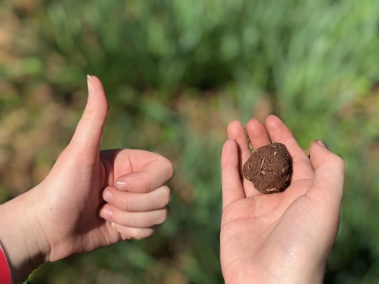
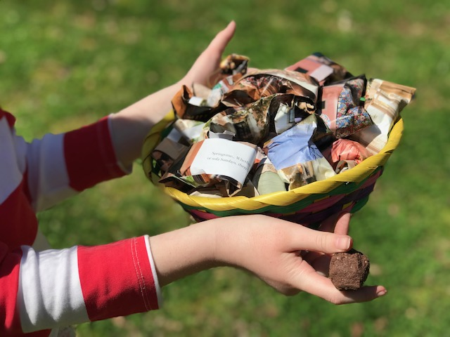

**Do you like plants?** I know bees do, and I do, too! Help [save the bees](https://thebeeconservancy.org/10-ways-to-save-the-bees/)!

Here is a picture of one of my bee bombs: 

Here are a number of my packaged bee bombs: 

These "bee bombs" do not hurt bees, but help them make pollinate flowers and make honey.

Please do not use pesticides on any of your plants; this kills the bees, and doesn't really help much.  My plants are growing great without pesticides.
